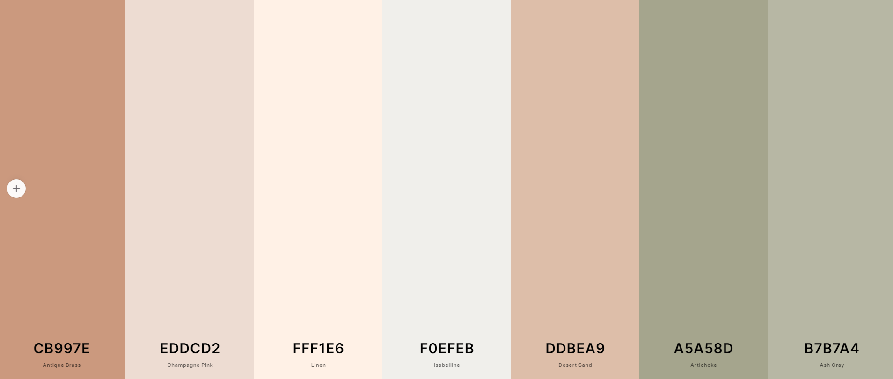
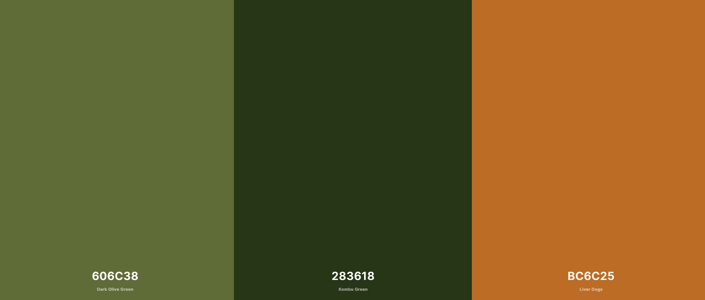

# GENUS

GENUS is a mobile-first website created to bring gamers together. Gaming is an art, a sport, a lifestyle. Video games have been around for over 4 decades and have evolved considerably. Nowadays games are used in various ways to enhance skills, blow off steam after a long day or relax during time off.

Genus has been designed with gamers at its core. Visitors will be welcome with information about our community and our ethos. They will find information about our various channels such as Twitch, YouTube or Discord. They will be able to browse through our gallery to see what and how we play video games. They will also find a contact us form to send us any queries and additional information of other channels available to reach us. 

The primary goal of this website is to inform users of who we are and what we do and why they should join us.

Genus was created for my Milestone 1 project in the Full Stack Web Development course I am currently undertaking at Code Institute.

[Live website like](https://mflaviusm.github.io/GENUS/)
## Features 

GENUS was designed with the user in mind to offer the best possible UX and UI.

# Table of Contents

1. [ Project Goals](https://github.com/mflaviusm/GENUS#project-goals)
2. [UX]()
3. [ Strategy Plane]()
    * [User Stories](https://github.com/mflaviusm/GENUS#user-stories)
4. [ Scope Plane](https://github.com/mflaviusm/GENUS/#user-stories)
    * [ Existing Features]()
    * [ Features left to implement]()
5.  [ Structure Plane]()
6.  [ Skeleton Plane]()
7.  [ Surface Plane]()
8. [ Technologies]()
9. [ Testing](testing.md)
10. [Deployment]()
11. [Credits]()
12. [Acknowledgements]()

## Project Goals
  * Create an online presence for GENUS
  * To promote gaming and video games
  * To offer an intuitive UI and excellent UX
  * To present users with various communication channels
  * To provide content on video games

## UX
UX design and principle were central and of the utmost importance for the development of this website. The five planes were used when planning the website structure and content and throughout the building of the website.

# Strategy Plane
### Client Goals
* As a client I was a website to increase awareness of my community.
* As a client, I was a clever platform where I can engage with my visitors.
* As a client, I want to offer my visitors an excellent user experience that will make them want to return.
* As a client, I will look for information that is displayed and conveyed accordingly to persuade users to join my community.

## User Stories
* As a visitor, I want to understand what audience the website is targeting.
* As a visitor, I want to find information about the GENUS community and what it has to offer.
* As a visitor, I want to navigate the website easily and find what I need.
* As a visitor, I want to see pictures of people playing video games together.
* As a visitor, I want to find social media links to be able to enjoy what GENUS has to offer.
* As a visitor, I want to be able to get in touch to get my queries solved.

## Opportunity Goal Table

At the early stages of the development, the opportunities for the website were determined and ranked according to their viability and importance.

| Opportunity | Importance | Viability |
| ----------- | ---------- | --------- |
| 1. Develop an online presence| 5 | 5 |
| 2. Increase the number of community members | 5 | 4 |
| 3. Promote the community | 5 | 5 |
| 4. Promote giveaways and contests | 4 | 3 |
| 5. Increase user feedback | 4 | 4 |
| 6. Provide contact information | 5 | 3 |
| 7. Increase the number of newsletter subscribers | 3 | 1 |
| 8. Online forum | 4 | 1 |
| 8. Offer live support | 4 | 1 |

# Scope Plane

Whilst working on the strategy stage of the development, features were verified against the viability and importance criteria. This ensured the project will not go beyond its short-term goals, therefore each feature has been categorised for immediate or future releases. The table below highlights each feature and its release date.

| Feature | Release | 
| ----------- | ---------- | 
| Develop an online presence | 1|
| Increase social media following | 1 |
| Promote the community | 2 |
| Promote giveaways and contests | 2 |
| Increase user feedback | 1| 
| Provide contact information | 1|
| Online forum | 3 | 
| Offer live support | 3 |

*1 - Immediate Release 2 - Short-term release 3 - Long-term*

## Existing Features

* Mobile-first responsive design
  * GENUS has been developed as a mobile-first design at its core to allow users to easily navigate and have an enjoyable experience whilst browsing the website. The website has been catered to behave responsively no matter the platform using Cascading Style Sheets.
* Navigation Bar
  * The navigation bar is present on each page and will stay at the top even when the users scroll through the website. This allows users to be able to navigate throughout the website content without having to scroll to the top each time they want to visit a different page of the website.
  * The navigation menu is present at all times within the bar under different shapes depending on the device. On small screens, it can be found in the top-right hand corner under the shape of a hamburger, whilst on a bigger screen, it is laid out with each page available for the website.
* The Landing Page
  * The landing presents the visitor to GENUS. It uses a hero image of two people playing video games which helps the user understand what the website is about.
  * The landing page also are prompted with a welcome message together with a Read More button that takes the visitor to the Community Page.
* Our promise/ ethos section
  * In our promise section visitors are presented with the values of GENUS and what the community is trying to achieve for its members.
  * In our ethos section visitors can read about the core principle and interest of GENUS which is: **Games make us better!**
* Homepage gallery
  * The homepage gallery is a preview of what GENUS does as a community. Visitors are presented with a picture of a gaming set-up and some more of people enjoying video games in the company of others.
* Footer 
  * The footer is the same throughout the website to ensure consistency and a good user experience.
  * The footer uses [Font Awesome](https://fontawesome.com/) for the various platforms GENUS is present at the moment. The pages open in a new tab when clicked on.
  * Offering easy access to social links will benefit GENUS as users can easily follow the community outside the website.
*  Our community page
  * The user is presented with information about what the community does in detail to help them fully understand the scope and purpose of GENUS.
  * It is then followed by a quick video of a person playing video games to spark their interest further.
  * Next section is the events where visitors will be able to find information about the events and giveaways within the community.
  * The users are presented with a series of games that have weekly tournaments.
  * The users are also offered a button to the Reddit community page of GENUS for detailed information about the events and giveaways, but also the community in general.
  * The community page also offers a section with members reviews to emphasize the quality of the services offered by the community and why people should join it.
  * The community page also contains information on the founder of the community which shows that GENUS is true to its purpose.
* The gallery page
  * It contains a gallery of images taken at a meetup of members from the community or individual play sessions.
  * Depending on the device the website is accessed it has different breakpoints offering fewer pictures on a mobile device and more on a desktop screen.
* The contact us page
  * It presents the visitors with an enquiry form for both business community enquiries.
  * It also offers additional communication channels and availability for them.

## Features not implemented 

* Online forum
  * A forum that would allow users to discuss various topics, post helpful tips, ask for help, create articles and threads related to gaming.

* Online live support
  * An online chat service available 24/7 to allow users and visitors to have their queries solved in minimal wait time.

* Newsletter
  * Create a community newsletter that will contain any updates from the gaming industry, events and giveaways from GENUS.

# Structure Plane

The website has been designed to be simple and easy to navigate. Any future updates will be supported with the current hierarchical structure.

The navigation bar has been designed to be always on top to ensure visitors can easily find information and navigate through the website's various pages.

#Skeleton Plane

## Wireframes

This project has had its wireframes developed using [Figma](https://www.figma.com/)

| Mobile | Tablet| Desktop|
--------------------|--------------------|--------------------------|
| [Mobile Home Page](assets/readme-images/mobile-homapge.png) | [Tablet Home Page](assets/readme-images/tablet-homepage.png) | [Desktop Home Page](assets/readme-images/desktop-homepage.png) |
| [Mobile Community Page](assets/readme-images/mobile-community.png) | [Tablet Community Page](assets/readme-images/tablet-community.png) | [Desktop Community Page](assets/readme-images/desktop-community.png) |
| [Mobile Gallery](assets/readme-images/mobile-gallery.png) | [Tablet Gallery Page](assets/readme-images/tablet-gallery.png) | [Desktop Gallery Page](assets/readme-images/desktop-gallery.png) |
| [Mobile Contact Us Page](assets/readme-images/contact-us.png) | [Tablet Contact Us Page](assets/readme-images/tablet-contact-us.png) | [Desktop Contact Us Page](assets/readme-images/desktop.contact-us.png) |

## Changes to Wireframes
Throughout the development of the website, some changes have been made.

1. Landing page newsletter form 
  * The sign-up form on the landing page has been removed as the newsletter is yet to be implemented.

2. Twitch Stream Iframe 
  * The Twitch iframe has been removed from the community page as it was unnecessary content. Visitors still have the option to access our Twitch stream from the footer of the website.

3. The founder section
  * The Founder section has been moved from the Contact Us page to the community page as given its content and purpose it was more suited to the community page.

4. Contact Us page newsletter form
  * The newsletter application form has been removed as it is yet to be implemented and will be pushed back in later updates.

5. Business and user enquiries
  * The business and partnership section has been merged with the additional communication channels for members and visitors and both serve the same purpose and having them separately was pointless.

# Surface Plane
 The colour palette choice was thought of as a representation of positivity and belongingness.

## Colour Pallete

During the initial development, a choice of warm colours was used to be more pleasant and welcoming to our visitors.

The initial colour palette was chosen using [Coolors.](https://coolors.co/)

After the development was finished the colour palette was altered, the below colours being used as definitive choices.

## Images
The images used in the development help emphasize the purpose of GENUS and offer a glimpse into the community.

# Technologies
## Languages
  - HyperText Markup Language
  - Cascading Style Sheets 3 

  ## Frameworks and Libraries

 - [Am I Responsive?](http://ami.responsivedesign.is/) was used to create the mockups.
 - [Figma](https://www.figma.com/) was used to design the wireframes.
 - [Coolors](https://coolors.co/) was used to choose the colour palette for the project.
 - [Font Awesome](https://fontawesome.com/) was used for the social links icons.
 - [GitHub](https://github.com/) was used to store the repository.
 - Git was used for version control and push code to GitHub.
 - [Visual Studio Code](https://code.visualstudio.com/) was used as IDE for the development of the website.
 - [Lamdatest](https://www.lambdatest.com/lp/cross-browser-testing/) was used to check responsiveness.
 - [PageSpeed Insights](https://developers.google.com/speed/pagespeed/insights/) was used to check responsiveness.
 - [BrowserStack](https://www.browserstack.com/) was used to check browser compatibility.
 - [Pexels](https://www.pexels.com/) was used to get stock images.

# Testing
All the testing information can be found in a separate [README](testing-file.md) file.

# Deployment
The deployment of the project to a live server was done with the following steps:

  - Each change was added and committed in VSC and pushed to GitHub.
  - Login to GitHub account.
  - Locate the MS1 repository.
  - Top right corner, locate settings and click it.
  -On the left side of the menu locate the Pages section and click it.
  - Locate Source in Pages and click the dropdown menu and select master.
  - Next click save.
  - The page will automatically refresh and present you with a link above the Source, which is the link to the live site. The like may take a few minutes to become available until the deployment is finished.
  - The deployed version is the same as the development version for the project.

# Forking the GitHub Repository
The repository forking is possible on GitHub. It creates a copy of the repository which can be viewed and amended without affecting the original. To fork the repository use the following steps:
 - Login to GitHub and locate the repository.
 - At the top right, under the avatar click the Fork button.
 - A copy has now been created to your GitHub account.

# Cloning the repository
The repository can be cloned and doing so creates a copy on your pc. The copy can be modified and it will not affect the original repository. Please follow the next steps to clone the repository:
 - Login to GitHub and locate the repository.
 - Click on the 'Code' button.
 - Copy the HTTPS link provided.
 - Go to your prefered IDE and open the terminal.
 - Change your current directory to the file path you want to clone the repository.
 - Type 'git clone' followed the link copied previously.
 - Press enter to create the clone.
 - For additional information, please refer to the GitHub documentation.

 # Credits
 
 ## Content
 All the content was written by the developer.

 ## Media

 Images from Pexels and owned by the developer were used in this project.

 # Acknowledgements
 To my mentor Rahul for providing invaluable advice and support.

 Code Institute for their support.

 Slack community members for offering advice and feedback.

