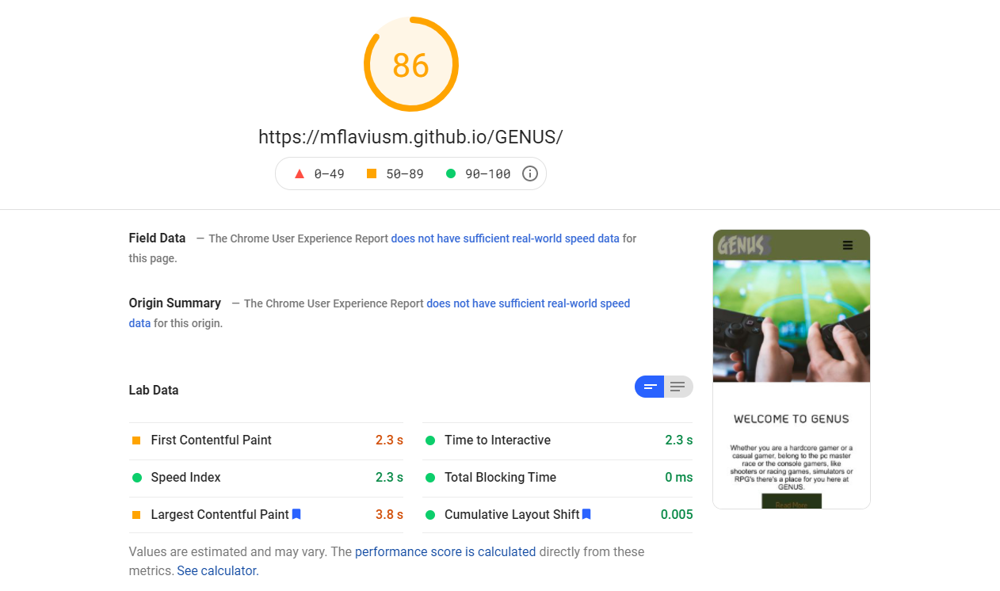

# Testing Page

## Code Validation
  * The W3 Markup Validation Service has been used to check all the HTML files from the project. The only errors found were missing tags, which have been corrected.
  

  * The W3 CSS Validation Service has been used to check all the CSS files from the project. No errors were found.
  

 ## Responsiveness

The responsiveness of the website was tested using PageSpeed Insights and Lambdatest.

[PageSpeed Insights](https://developers.google.com/speed/pagespeed/insights/)

[Lambdatest](https://www.lambdatest.com/lp/cross-browser-testing/)

## Browser Compatibility

The website was developed on Google Chrome 91.0.4472.114.

BrowserStack was used to check browser compatibility.
The website has been checked against various browsers and versions such as:
 - Mozilla Firefox: 89 to 82
 - Google Chrome: 91 to 85
 - Opera: 77 to 72
 - Microsoft Edge: 91 to 89

## Bugs

The following bugs were encountered and fixed during development:

- The YouTube iframe was overlapping the navbar when scrolling down the community page. The issue was fixed by removing the absolute positioning given to the iframe.
- The footer was not sticking to the bottom of the page if the viewport was higher than the content was filling. The issue was fixed by creating a div to cover the entire body and style it with flexbox.
- Long loading times for the gallery page. All images have been compressed to improve the loading times.
